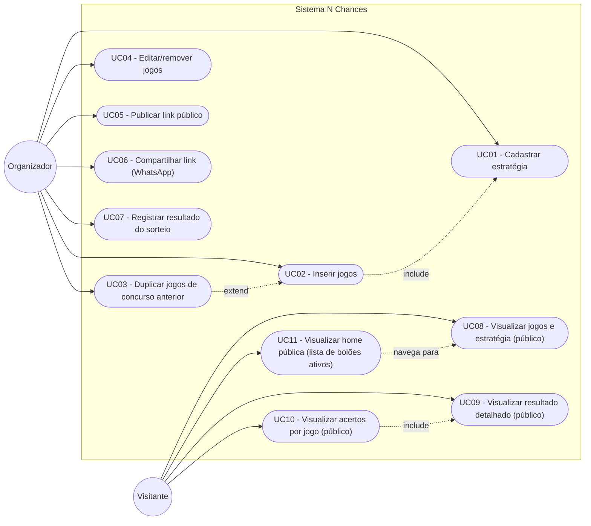
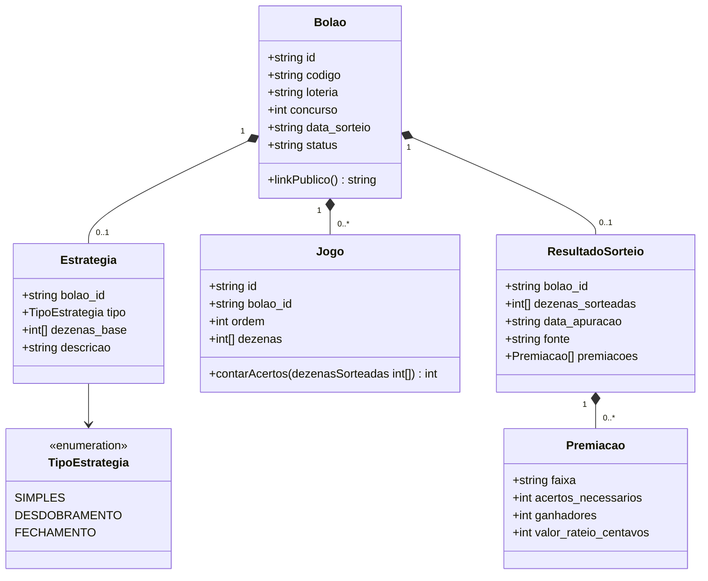
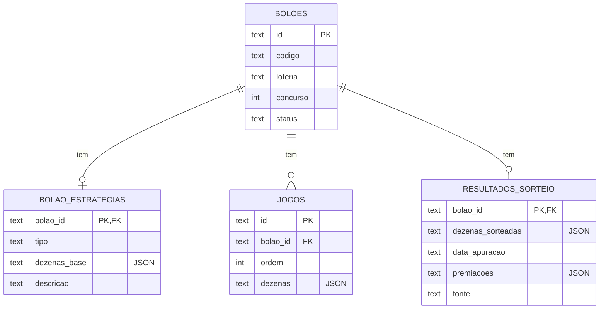
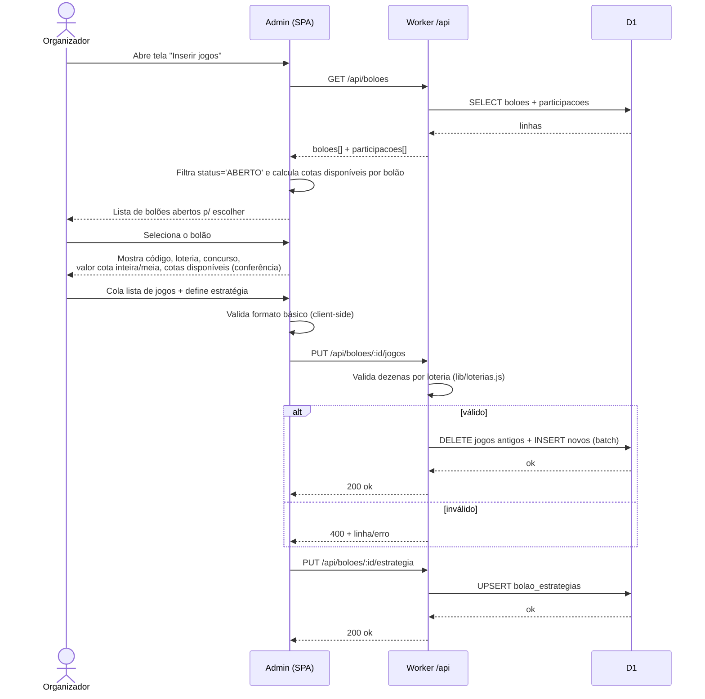
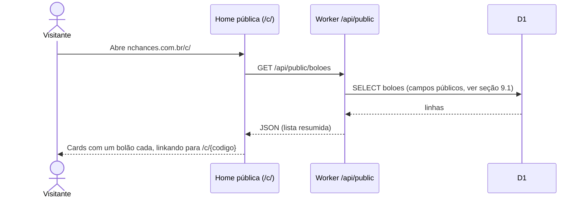
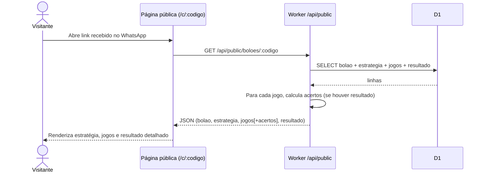
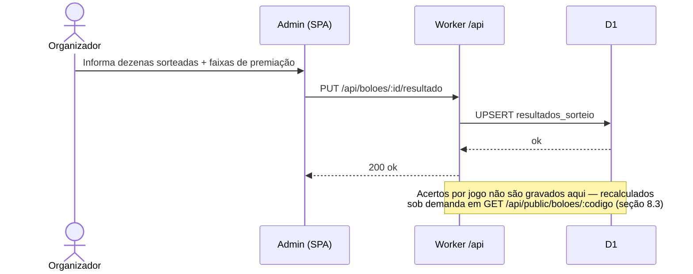

# Funcionalidade: Jogos do Concurso, Estratégia e Resultado do Sorteio

Documentação técnica da nova funcionalidade do Sistema N Chances: cadastro facilitado
dos jogos de um bolão, publicação de uma página pública (link único) com a estratégia
adotada e os jogos escolhidos, e atualização/exibição do resultado detalhado do sorteio.

Baseado no estado real do repositório (`worker/migrations`, `worker/src/routes/boloes.js`,
`worker/src/lib/negocio.js`, `worker/src/lib/serializers.js`, `worker/wrangler.toml`) em
2026-07-29.

---

## 1. Contexto

Hoje o bolão (tabela `boloes`) já guarda um campo `jogos_descricao` (texto livre, uma
linha por jogo) e um campo `premio_estimado` (texto livre). Esses dois campos só são
usados para montar a mensagem de comprovante enviada individualmente por WhatsApp a cada
participante (`public/index.html`, função que monta `mensagem` a partir de
`bolao.jogos_descricao.split('\n')`). Não existe hoje:

- Nenhuma estrutura para a **estratégia** usada na escolha dos números (desdobramento,
  fechamento etc.) — é só texto solto, quando registrado.
- Nenhuma **página pública** com os jogos do concurso. A divulgação hoje é manual, via
  planilha e prints.
- Nenhum registro estruturado do **resultado do sorteio** nem cálculo de acertos por
  jogo.

Esta funcionalidade substitui o uso de planilha para divulgação, aproveitando o `codigo`
que o bolão já recebe na criação (ex.: `QN-70750001`, ver `negocio.js:gerarCodigoBolao`)
como identificador do link público.

## 2. Objetivo

Permitir que o organizador:

1. Cadastre os jogos de um concurso de forma rápida (colar uma lista, uma linha por
   jogo, igual ao fluxo que ele já usa hoje em `jogos_descricao` — só que agora validado
   e estruturado).
2. Registre a estratégia adotada (Desdobramento, Fechamento ou nenhuma) e as dezenas
   base usadas nela.
3. Publique um link público (`nchances.com.br/c/{codigo}`) para divulgar os jogos aos
   participantes e interessados, sem exigir login.
4. Registre o resultado oficial do sorteio (dezenas sorteadas + premiação por faixa) e
   veja automaticamente, na página pública, quantos acertos cada jogo teve.

### Fora de escopo (v1)

- Geração automática das combinações de um fechamento matemático (o organizador já traz
  os jogos prontos de onde ele mesmo os gerou hoje — planilha, gerador externo, etc.).
  Fica só o cadastro facilitado, não o cálculo combinatório.
- Busca automática do resultado oficial em API da Caixa. V1 é registro manual. Ver seção
  11 para uma proposta de V2.

## 3. Glossário

| Termo | Significado |
|---|---|
| Concurso | Edição/sorteio específico de uma loteria (já existe: `boloes.concurso`) |
| Dezena | Um número escolhido dentro da faixa válida da loteria (ex.: 1 a 60 na Mega-Sena) |
| Jogo | Uma combinação de dezenas, correspondendo a **uma aposta simples** feita na Caixa |
| Estratégia | Método usado para chegar nos jogos finais a partir de um conjunto maior de dezenas: **Desdobramento** ou **Fechamento** (ou nenhuma, jogos avulsos) |
| Dezenas base | O conjunto maior de números escolhido na estratégia, do qual os jogos foram derivados (ex.: 20 dezenas fechadas em jogos de 6) |
| Resultado do sorteio | Dezenas sorteadas oficialmente + premiação por faixa de acerto |
| Acertos | Quantidade de dezenas de um jogo que bateram com o resultado do sorteio (calculado, não armazenado) |

## 4. Casos de uso

### 4.1 Atores

- **Organizador** — usuário autenticado (hoje, atrás do Cloudflare Access), já gerencia
  bolões/participações/pagamentos no sistema.
- **Visitante** — qualquer pessoa com o link público, sem login (participante do bolão,
  ou interessado que recebeu o link por WhatsApp).

### 4.2 Diagrama de casos de uso



### 4.3 Especificação dos casos de uso

**UC01 — Cadastrar estratégia**
Pré-condição: bolão existe. Fluxo principal: organizador escolhe o tipo (Simples,
Desdobramento, Fechamento), opcionalmente informa as dezenas base e uma descrição livre
(ex.: "Fechamento 20 dezenas em 6, garante quadra com 11 acertos"). Pós-condição:
estratégia associada ao bolão (1:1).

**UC02 — Inserir jogos**
Fluxo principal: **(1) organizador seleciona a qual bolão os jogos pertencem**, escolhendo
entre os bolões com `status = 'ABERTO'` no sistema (lista já disponível via `GET
/api/boloes`, filtrada client-side — não precisa de endpoint novo). Ao selecionar, a tela
traz e exibe, só para conferência (read-only, sem re-digitação): código do bolão, loteria,
número do concurso, valor da cota inteira, valor da cota meia e cotas disponíveis. **Cotas
disponíveis é um valor computado** (`quantidade_cotas − cotas já reservadas em
participações`), no mesmo espírito da checagem de limite já feita em
`boloes.js:addParticipacao` — **não** é para usar a coluna `boloes.cotas_disponiveis`, que a
migração `0002` já registra como não utilizada/desatualizada pelo app. (2) Com o bolão
certo confirmado, organizador cola a lista de jogos (uma linha por jogo, dezenas separadas
por espaço/vírgula — mesmo hábito de hoje). Sistema faz parse linha a linha, valida
quantidade e faixa de dezenas conforme a loteria do bolão selecionado (seção 6.3), mostra
erros inline por linha e salva só quando tudo é válido. Fluxo alternativo: organizador
digita/edita jogo a jogo em uma grade, sem colar texto.

**UC03 — Duplicar jogos de concurso anterior**
Estende UC02: organizador escolhe um bolão anterior (mesma loteria) e o sistema
pré-preenche os jogos e a estratégia, para o caso comum de repetir os mesmos números.

**UC04 — Editar/remover jogos**
Disponível enquanto o bolão não estiver `SORTEADO`. Reordena, edita ou remove jogos
individualmente.

**UC05 — Publicar link público**
Não é uma ação separada de fato: todo bolão com `codigo` já tem uma URL pública válida
(`/c/{codigo}`). O "publicar" é o organizador copiar/compartilhar esse link — não há
toggle de rascunho/publicado em v1 (ver riscos, seção 10).

**UC06 — Compartilhar link (WhatsApp)**
Botão que monta uma mensagem pronta (nome do bolão, prêmio estimado, link) e abre
`wa.me/?text=...`, no mesmo padrão já usado para o comprovante individual.

**UC07 — Registrar resultado do sorteio**
Fluxo principal: organizador informa as dezenas sorteadas e, opcionalmente, a
premiação por faixa (nome da faixa, acertos necessários, nº de ganhadores nacional,
valor do rateio) copiando do resultado oficial. Pode ser feito a qualquer momento após a
data do sorteio; não depende de o bolão estar marcado `SORTEADO` no fluxo financeiro
(que já existe e trata prêmio ganho pelo bolão, não o resultado oficial do sorteio em
si — são conceitos diferentes, ver seção 5.2).

**UC08 — Visualizar jogos e estratégia (público)**
Sem login. Mostra dados do concurso (loteria, nº do concurso, data do sorteio),
estratégia adotada e a lista completa de jogos.

**UC09 — Visualizar resultado detalhado (público)**
Só aparece se o resultado já foi registrado (UC07). Mostra as dezenas sorteadas e a
tabela de premiação por faixa.

**UC10 — Visualizar acertos por jogo (público)**
Inclui UC09. Para cada jogo, calcula e destaca quantas dezenas bateram com o sorteio
(cálculo em tempo de exibição, não armazenado).

**UC11 — Visualizar home pública (lista de bolões ativos)**
Sem login. Como pode haver mais de um bolão ativo ao mesmo tempo, o link "principal"
(`nchances.com.br/c/`) não aponta direto para um bolão específico — mostra uma lista
(cards) com todos os bolões relevantes no momento (ver critério de listagem na seção 9.1),
cada um linkando para sua página individual (UC08, via `/c/{codigo}`). É o ponto de
entrada para quem não recebeu um link direto de um bolão específico.

## 5. Modelo de domínio (classes)

O código do worker é funcional (rotas + funções puras em `lib/`, sem classes), então o
diagrama abaixo é um **modelo conceitual de domínio** — mapeia para tabelas/serializers e
funções em `lib/`, não para classes reais no código (mesmo estilo de `negocio.js` hoje).

### 5.1 Diagrama de classes



### 5.2 Notas sobre as classes

- **Bolao**: entidade já existente (`boloes`). Nenhum campo novo obrigatório; os campos
  legados `jogos_descricao` e `premio_estimado` continuam existindo para não quebrar o
  comprovante de WhatsApp atual, mas deixam de ser a fonte de verdade dos jogos — a
  migração recomendada é ler de `Jogo`/`Estrategia` e, se vazio, cair para
  `jogos_descricao` (compatibilidade com bolões antigos).
- **ResultadoSorteio vs. `premio_ganho_centavos`**: são conceitos diferentes e não devem
  ser fundidos. `boloes.premio_ganho_centavos` é quanto **este bolão especificamente**
  ganhou (usado hoje para ratear prêmio entre participantes via `sortear()` em
  `routes/boloes.js`). `ResultadoSorteio` é o resultado **oficial do concurso** (dezenas
  sorteadas, premiação nacional por faixa) — é isso que a página pública precisa mostrar
  em detalhe, independente de o bolão ter sido premiado ou não.
- **Jogo.contarAcertos**: função pura, não persistida — calculada a cada leitura
  (interseção entre `jogo.dezenas` e `resultado.dezenas_sorteadas`).

## 6. Modelo de dados

### 6.1 Diagrama entidade-relacionamento



### 6.2 DDL sugerida (migração `0004_jogos_estrategia_resultado.sql`)

Seguindo as convenções já usadas em `worker/migrations` (IDs TEXT via
`crypto.randomUUID()`, timestamps TEXT ISO 8601 escritos pelo Worker, sem tipos JSON
nativos — arrays guardados como TEXT/JSON, igual ao resto do schema em SQLite/D1):

```sql
CREATE TABLE bolao_estrategias (
  bolao_id      TEXT PRIMARY KEY REFERENCES boloes(id) ON DELETE CASCADE,
  tipo          TEXT NOT NULL DEFAULT 'SIMPLES'
                   CHECK (tipo IN ('SIMPLES','DESDOBRAMENTO','FECHAMENTO')),
  dezenas_base  TEXT,           -- JSON: ex. "[1,4,7,12,...]"
  descricao     TEXT,
  criado_em     TEXT NOT NULL,
  atualizado_em TEXT
);

CREATE TABLE jogos (
  id         TEXT PRIMARY KEY,
  bolao_id   TEXT NOT NULL REFERENCES boloes(id) ON DELETE CASCADE,
  ordem      INTEGER NOT NULL,
  dezenas    TEXT NOT NULL,     -- JSON: ex. "[3,7,15,22,41,44]"
  criado_em  TEXT NOT NULL
);
CREATE INDEX idx_jogos_bolao ON jogos(bolao_id);
CREATE UNIQUE INDEX idx_jogos_bolao_ordem ON jogos(bolao_id, ordem);

CREATE TABLE resultados_sorteio (
  bolao_id          TEXT PRIMARY KEY REFERENCES boloes(id) ON DELETE CASCADE,
  dezenas_sorteadas TEXT NOT NULL,   -- JSON: ex. "[3,9,15,22,41,44]"
  data_apuracao     TEXT,
  premiacoes        TEXT,            -- JSON: [{faixa, acertos_necessarios, ganhadores, valor_rateio_centavos}]
  fonte             TEXT NOT NULL DEFAULT 'manual' CHECK (fonte IN ('manual','api_caixa')),
  criado_em         TEXT NOT NULL,
  atualizado_em     TEXT
);
```

### 6.3 Regras de validação e aparência por loteria

Tabela de referência única (proposta de `worker/src/lib/loterias.js`, no mesmo espírito de
`cotas.js`/`money.js`) usada tanto para validar cada linha colada no UC02 quanto para
decidir a cor da bola na exibição pública (seção 9.3) — uma fonte só, sem duplicar a
associação loteria→cor em dois lugares do código.

As cores vieram da **"Paleta jogos"** oficial do *Manual de Identidade Visual das Loterias
CAIXA* (Livro da marca v.1, cap. 7 "Loterias CAIXA", seção 7.2.1 "paleta de cores",
páginas 420–421 do capítulo — arquivo enviado pelo usuário). É a paleta que a própria
Caixa define como **exclusiva para identificar cada jogo** ("Cada cor só deve ser usada
por seu respectivo jogo") — a fonte mais correta possível para esta funcionalidade, mais
confiável que qualquer aproximação visual feita a partir do site.

| Loteria | Dezenas por jogo (mín–máx) | Faixa válida | Cor oficial ("Paleta jogos") | Pantone (Uncoated®) |
|---|---|---|---|---|
| Mega-Sena | 6–15 | 1–60 | Verde `#00AB67` (R0 G171 B103) | 354 U |
| Lotofácil | 15–20 | 1–25 | Roxo `#803594` (R128 G53 B148) | 2593 U |
| Quina | 5–15 | 1–80 | Azul `#005DA4` (R0 G93 B164) | 288 U |
| Lotomania | 50 (fixo) | 1–100 | Laranja `#F99D1C` (R249 G157 B28) | 143 U |
| Dupla-Sena | 6–15 | 1–50 | Vinho `#A62A52` (R166 G42 B82) | 201 U |
| Timemania | 10 (fixo) | 1–80 | Amarelo `#FFDD00` (R255 G221 B0) | Yellow U |
| Outro | sem validação automática | — | Cinza neutro `#6B7280` (sem equivalente oficial — loteria fora do catálogo coberto pela paleta) |

Duas correções importantes em relação à primeira versão desta tabela (que era um palpite,
sem consulta ao manual): **Lotomania é laranja, não amarelo**, e **Timemania é amarelo, não
verde** — tinha invertido as duas.

O manual também define uma variante "escura" de cada cor (uso em apoio/hover/traço — ex.
Verde-escuro da Mega-Sena `#009B63`, Azul-escuro da Quina `#00508F`, Roxo-escuro da
Lotofácil `#702A82`, Laranja-escuro da Lotomania `#F58220`, Vinho-escuro da Dupla-Sena
`#90214A`), útil se a bola precisar de um estado hover/pressed sem sair da identidade da
loteria.

## 7. API (novos endpoints)

Seguindo o padrão REST já usado em `src/index.js` (`/api/boloes/:id/...`):

| Método | Rota | Autenticação | Descrição |
|---|---|---|---|
| GET | `/api/boloes/:id/estrategia` | Access (organizador) | Lê a estratégia |
| PUT | `/api/boloes/:id/estrategia` | Access (organizador) | Cria/atualiza a estratégia |
| GET | `/api/boloes/:id/jogos` | Access (organizador) | Lista os jogos |
| PUT | `/api/boloes/:id/jogos` | Access (organizador) | Substitui a lista inteira de jogos (suporta o fluxo "colar e salvar" do UC02) |
| GET | `/api/boloes/:id/resultado` | Access (organizador) | Lê o resultado |
| PUT | `/api/boloes/:id/resultado` | Access (organizador) | Cria/atualiza o resultado do sorteio |
| GET | `/api/public/boloes` | **Sem Access** (ver seção 10) | Lista resumida dos bolões da home pública (UC11) — só campos públicos, sem dados de participantes |
| GET | `/api/public/boloes/:codigo` | **Sem Access** (ver seção 10) | Bolão + estratégia + jogos + resultado + acertos já calculados — usado pela página pública (UC08–UC10) |

`GET /api/boloes` (já existente) não precisa mudar para suportar a seleção de bolão do
UC02 — o admin já carrega essa lista completa hoje; o filtro por `status='ABERTO'` e o
cálculo de cotas disponíveis (soma de `participacoes.cotas_meias` por `bolao_id`, já
retornada junto por esse mesmo endpoint) podem ser feitos inteiramente no client.

`PUT /api/boloes/:id/jogos` recebendo a lista inteira (em vez de POST/PATCH por item)
simplifica o caso de uso principal: colar N linhas e salvar tudo de uma vez, com
validação atômica (se uma linha for inválida, nada é salvo — mesma filosofia de
`env.DB.batch()` já usada no restante do projeto).

## 8. Fluxos de sequência

### 8.1 Selecionar bolão e inserir jogos e estratégia



### 8.2 Acesso à home pública (lista de bolões ativos)



### 8.3 Acesso público ao link de um bolão



### 8.4 Registrar resultado do sorteio



## 9. Páginas públicas — estrutura de conteúdo

Duas páginas públicas, ambas mobile-first (abertas majoritariamente a partir de um link
recebido no WhatsApp):

### 9.1 Home (`nchances.com.br/c/`) — UC11

Existe porque pode haver **mais de um bolão ativo ao mesmo tempo** — sem uma home, só
seria possível divulgar um bolão por vez (um link direto), o que não cobre o caso comum de
vários concursos rodando em paralelo.

1. **Lista de bolões**: um card por bolão, cada um linkando para `/c/{codigo}`. Critério
   de listagem sugerido para v1 (sem paginação — revisar se a base de bolões crescer
   muito): `status IN ('ABERTO','FECHADO','SORTEADO')`, ordenado por `data_sorteio DESC`,
   sem limite de tempo fixo (simples de implementar, cobre o caso real de hoje).
2. **Card do bolão**: código, loteria, nº do concurso, data do sorteio e status
   (Aberto/Fechado/Sorteado) — os mesmos campos públicos do endpoint de detalhe (seção
   9.2), sem os jogos.
3. Sem resultado nem lista de jogos na home — isso fica na página de detalhe, ao clicar
   no card.

### 9.2 Detalhe do bolão (`nchances.com.br/c/{codigo}`) — UC08, UC09, UC10

1. **Cabeçalho**: nome/loteria + nº do concurso, data do sorteio, código do bolão,
   status (Aberto / Fechado / Sorteado).
2. **Estratégia**: rótulo do tipo (Desdobramento / Fechamento / Simples), dezenas base
   (se informadas) e descrição livre.
3. **Jogos**: lista numerada de todos os jogos, dezenas em destaque; se houver
   resultado, cada dezena que bateu é marcada visualmente e a contagem de acertos
   aparece ao lado do jogo (ordenado por mais acertos primeiro, para achar rápido quem
   se destacou).
4. **Resultado do sorteio** (só aparece se registrado): dezenas sorteadas em destaque e
   tabela de premiação por faixa (faixa, acertos necessários, ganhadores, valor do
   rateio) — a mesma informação que aparece no resultado oficial.
5. **Rodapé**: aviso de que é conteúdo informativo do bolão N Chances, sem dados
   pessoais de participantes (a página pública nunca deve expor telefone, nome ou valor
   pago de ninguém — só o conteúdo do concurso). Vale também para a home (9.1) e para o
   endpoint `GET /api/public/boloes`: nunca retornar valor arrecadado, participantes ou
   qualquer dado financeiro além dos valores de cota já públicos por natureza (valor da
   cota inteira/meia é informação de venda, não dado pessoal).

### 9.3 Design das dezenas — bolas coloridas por loteria

Toda dezena exibida (lista de jogos em 9.2, dezenas base da estratégia, dezenas
sorteadas) usa o mesmo componente visual: uma bolinha circular na cor de marca da loteria
do bolão (tabela da seção 6.3), imitando o padrão que qualquer apostador já reconhece dos
sites/apps de resultado — não uma lista de números em texto corrido.

- **Forma**: círculo (`border-radius: 50%`), número centralizado, fonte em negrito.
- **Cor de fundo**: a cor de marca da loteria do bolão (uma cor só por bolão inteiro —
  não varia dezena a dezena dentro do mesmo jogo).
- **Cor do texto**: calculada por contraste real (WCAG AA, mínimo 4.5:1), não por "branco
  como padrão" — checado cor a cor contra a paleta oficial da seção 6.3:

  | Loteria | Fundo | Branco | Preto | Texto a usar |
  |---|---|---|---|---|
  | Mega-Sena | `#00AB67` | 2.99:1 (reprova) | 7.02:1 | **Preto** |
  | Lotofácil | `#803594` | 7.36:1 | 2.85:1 | Branco |
  | Quina | `#005DA4` | 6.77:1 | 3.10:1 | Branco |
  | Lotomania | `#F99D1C` | 2.13:1 (reprova) | 9.87:1 | **Preto** |
  | Dupla-Sena | `#A62A52` | 6.83:1 | 3.07:1 | Branco |
  | Timemania | `#FFDD00` | 1.35:1 (reprova) | 15.59:1 | **Preto** |

  O manual da Caixa usa texto verde-Mega-Sena sobre o amarelo Timemania na logomarca (pra
  fazer referência à Seleção Brasileira) — testei essa combinação e ela também reprova AA
  (2.22:1), então **não replicar isso na bola**: para o número dentro da bolinha, usar
  preto em Timemania, Lotomania e Mega-Sena, e branco nas outras três. Isso é uma
  divergência deliberada do manual de marca (que é pensado para logotipo grande, não para
  texto pequeno dentro de um círculo de poucos pixels).
- **Estados**:
  - *Normal*: cor de marca da loteria, sem destaque adicional (jogos antes do sorteio, ou
    dezenas que não bateram).
  - *Acerto* (só depois do resultado registrado — UC10): borda/anel de destaque (ex.:
    contorno dourado) mais um leve efeito (sombra ou preenchimento mais saturado) na
    mesma bola, sem trocar a cor de base — o objetivo é continuar reconhecível como "bola
    da Mega-Sena" (por ex.), só que marcada como acertada.
  - *Dezena sorteada* (na seção "Resultado do sorteio"): mesma bola, mesma cor de marca;
    não precisa de estado extra, é sempre "sorteada" nesse contexto.
- **Layout**: grid responsivo, bolas quebrando linha conforme a largura da tela (mobile
  primeiro); cada jogo numerado acima da sua fileira de bolas.
- **Fonte única da cor**: a cor de cada loteria fica só em `lib/loterias.js` (seção 6.3),
  consumida tanto pelo admin (se ele também exibir dezenas como bolas) quanto pela página
  pública — evita a cor "descolar" entre as duas telas.

## 10. Requisitos não funcionais e riscos

- **Cloudflare Access (crítico)**: hoje `nchances.com.br`/`www.nchances.com.br` está
  atrás de Cloudflare Access (há um Service Token documentado em
  `Site NChances Token de Serviços.txt`, e `.claude`/`.agents` trazem skill
  `cloudflare-one`). A página pública **não pode** ficar atrás desse Access, senão
  visitantes sem conta não conseguem abrir o link. Isso não se resolve em código: é
  preciso criar, no Zero Trust Dashboard, uma política de bypass (ou uma Access
  Application separada) para os caminhos `/c/*` e `/api/public/*`. Sem isso configurado,
  a funcionalidade não funciona em produção mesmo com o código pronto.
- **`not_found_handling = "single-page-application"`**: o `wrangler.toml` hoje serve um
  único `index.html` como SPA para tudo que não é `/api/*`. As rotas `/c/` (home, UC11) e
  `/c/:codigo` (detalhe, UC08–UC10) precisam ser tratadas dentro dessa mesma SPA
  (roteamento client-side) ou via um segundo bundle estático próprio (`public/c.html` +
  seu próprio roteamento simples entre lista/detalhe) servido pelos assets — a segunda
  opção facilita aplicar o bypass do Access por caminho de arquivo, e mantém o bundle
  público independente do admin (menos JS carregado por quem só quer ver os jogos).
  Alterar o segundo HTML altera `run_worker_first`/roteamento do `[assets]`, então quem
  for implementar deve revisar wrangler.toml junto.
- **Sem dado pessoal na rota pública**: `GET /api/public/boloes/:codigo` deve usar um
  serializer próprio (não `serializeBolao`/`serializeParticipacao`), retornando só bolão
  + estratégia + jogos + resultado — nunca telefone, nome ou valores de participação.
- **`codigo` como chave pública**: já é único (`idx_boloes_codigo`) e sequencial e
  previsível (`QN-70750001`). Isso é aceitável pois já é exposto hoje nos comprovantes de
  WhatsApp — mas vale registrar que alguém poderia tentar variar a sequência e "adivinhar"
  outro bolão. Como a página pública não expõe dados sensíveis (ver ponto acima), o risco
  é baixo; se algum dia isso mudar, considerar um token opaco adicional só para a URL
  pública.
- **Bolão sem jogos/estratégia cadastrados**: a página pública deve tratar
  graciosamente (ex.: "jogos ainda não divulgados"), já que nem todo bolão antigo terá
  esses dados — só passa a existir a partir desta funcionalidade.
- **Paleta de cores por loteria (seção 6.3/9.3) é oficial**: extraída do *Manual de
  Identidade Visual das Loterias CAIXA* (arquivo enviado pelo usuário, seção 7.2.1 "Paleta
  jogos"), não mais um palpite visual. Único ponto de atenção: o PDF é de fev/2017 — se a
  Caixa tiver lançado um manual mais recente, vale um diff rápido antes de fechar a
  paleta definitiva, mas cores de marca tendem a durar anos sem mudar.

## 11. Fora de escopo / evolução futura

- **V2 — Colar e parsear automaticamente** um bloco de texto exportado da planilha atual
  (facilita a migração do hábito antigo para o novo fluxo).
- **V2 — Busca automática do resultado oficial** via API pública de loterias (ex.:
  serviço da Caixa ou um proxy como `loteriascaixa-api`), preenchendo
  `resultados_sorteio` automaticamente na data do sorteio e eliminando o registro manual
  do UC07.
- **V3 — Geração assistida de fechamento/desdobramento**: dado um conjunto de dezenas
  base e uma quantidade de jogos desejada, gerar as combinações automaticamente
  (problema puramente combinatório, independente do resto da funcionalidade).
